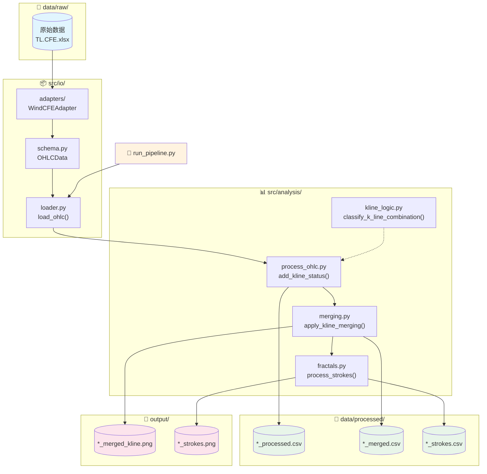
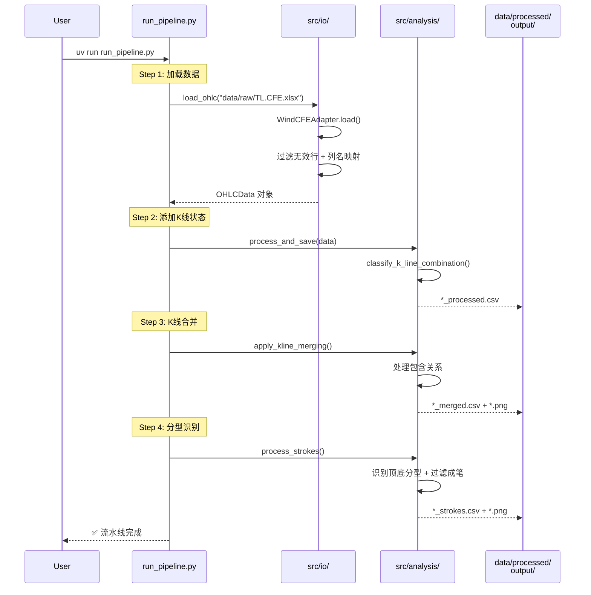
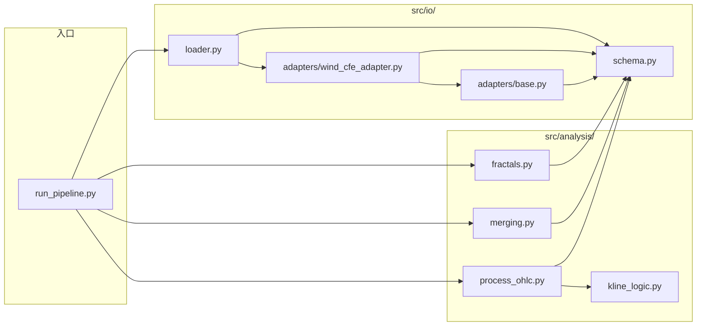

# K 线分析流水线 - 代码工作流

## 整体架构

## Pipeline 执行流程

## 模块依赖关系

## 数据转换流程

| 阶段 | 输入 | 处理 | 输出 |
|------|------|------|------|
| **加载** | xlsx/csv (Wind格式) | 过滤脏数据 + 列名标准化 | `OHLCData` 对象 |
| **状态标记** | `OHLCData` | 分类相邻K线关系 | `*_processed.csv` |
| **合并** | processed.csv | 处理包含关系 | `*_merged.csv` + 图 |
| **分型** | merged.csv | 识别顶底 + 笔过滤 | `*_strokes.csv` + 图 |
