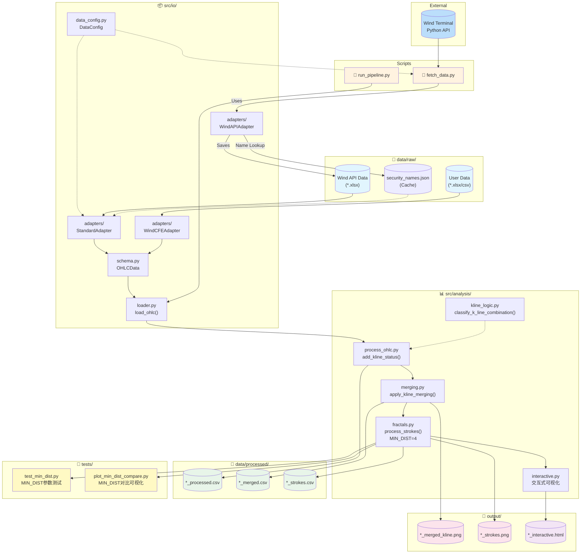
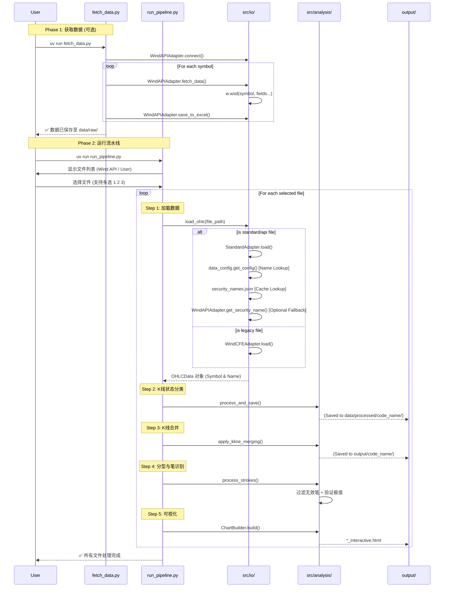
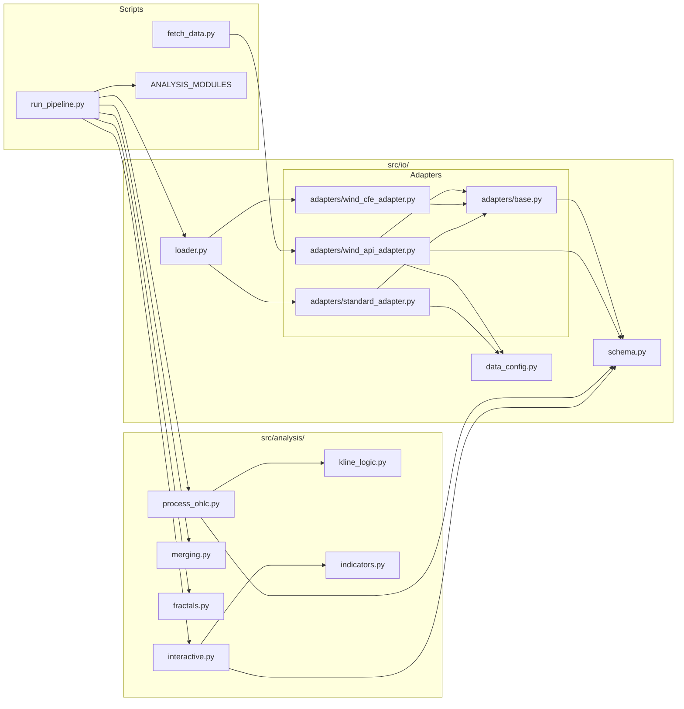

# K 线分析流水线 - 代码工作流

## 整体架构

## 数据获取与分析流程

## 模块依赖关系

## 数据转换流程

| 阶段 | 输入 | 下游/适配器 | 输出 | 说明 |
|------|------|-------------|------|------|
| **获取** | Wind Terminal | `WindAPIAdapter` | `*.xlsx` (Standard) | 自动解析名称并缓存至 `security_names.json` |
| **加载** | xlsx/csv | `StandardAdapter` | `OHLCData` | 优先读取缓存名称，**自动填充缺失的 open 列** |
| **加载(旧)**| xlsx/csv | `WindCFEAdapter` | `OHLCData` | 兼容旧版 Wind 导出格式 |
| **状态标记** | `OHLCData` | `process_ohlc` | `*_processed.csv` | 保存至 `processed/code_name/` 目录下 |
| **合并** | processed.csv | `merging` | `*_merged.csv` | 绘制图表保存至 `output/code_name/` 目录下 |
| **分型** | merged.csv | `fractals` | `*_strokes.csv` | 识别顶底分型，应用 MIN_DIST=4 过滤 |

## 已知限制

| 品种 | 问题 | 解决方案 |
|------|------|----------|
| `TB10Y.WI` | Wind API 不返回 `open` 字段 | 请从 Wind 终端手动下载数据 |

